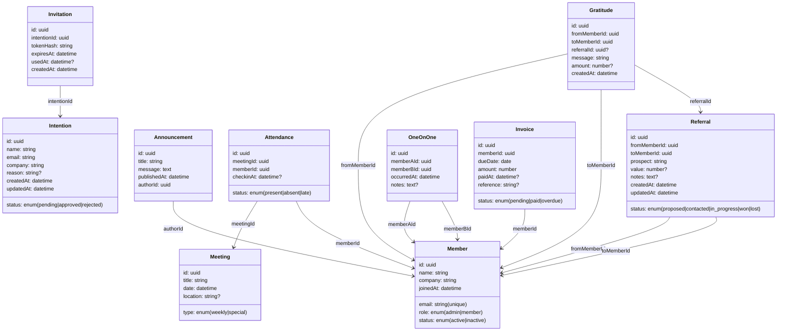

# Arquitetura — Plataforma de Gestão para Grupos de Networking

Documento de Arquitetura completo cobrindo todas as funcionalidades exigidas em
desafio.txt. A implementação prática inicial focará no fluxo P1 (Admissão de
Membros), porém a arquitetura é pensada para o sistema completo e escalável.

- ## 1) Visão Geral e Stack

- Frontend: Next.js 16 (App Router) + React 19.2
- Backend: Next.js API Routes (Node.js 20 LTS). Evolução: extrair para serviço
  Node (NestJS/Express) se necessário.
- Banco de Dados: SQLite (dev/avaliação). Produção recomendada: PostgreSQL.
- ORM: Prisma
- Gerenciador de pacotes: pnpm
- UI Kit: shadcn/ui com Tailwind; Primary #06B8EB; base Azul Escuro (#0B1B34) e Branco (#FFFFFF)
- Testes: Jest + React Testing Library + supertest
- Observabilidade: logs estruturados (pino/console JSON) + correlação por
  request ID
- Infra (futuro): Docker Compose para local; Vercel/Node server para deploy

## 2) Diagrama de Arquitetura

```mermaid
graph TD
  subgraph WebApp [Next.js App]
    UI[App Router (Páginas & Componentes)]
    API[API Routes (/api/*)]
  end

  DB[(DB: SQLite dev / PostgreSQL prod)]
  Queue[(Opcional Futuro: Fila de Emails)]

  UI -->|HTTP| API
  API -->|Prisma| DB
  API -.->|eventos/notify| Queue
```

## 3) Módulos Funcionais e Fluxos

### 3.1 Gestão de Membros

- Formulário público de intenção de participação (candidato)
- Área admin para aprovar/recusar intenções (protegida por `ADMIN_TOKEN` no
  ambiente de teste)
- Geração de convite com token (hash armazenado) e cadastro completo do membro

### 3.2 Comunicação e Engajamento

- Avisos/Comunicados: lista de anúncios visíveis para membros; CRUD para admin
- Reuniões e Check-in: cadastro de reuniões (admin) e presença (membro)

### 3.3 Geração de Negócios

- Indicações/Referências entre membros
- Status de indicações (proposed → contacted → in_progress → won → lost)
- “Obrigados” (agradecimentos públicos por negócios fechados)

### 3.4 Acompanhamento e Performance

- Reuniões 1 a 1 (1:1) entre membros
- Dashboards (KPIs principais) e relatórios (semanal, mensal, acumulado)

### 3.5 Financeiro

- Mensalidades: geração e controle de status (pending, paid, overdue)

## 4) Modelo de Dados (Entidades e Relacionamentos)



Notas:

- Índices: email único em Member; tokenHash único em Invitation; (meetingId,
  memberId) único em Attendance; índices por data para relatórios.
- Compatível com SQLite em dev e PostgreSQL em produção.

## 5) API (Contratos e Rotas Principais)

Estilo REST com JSON. Autorização simplificada por `ADMIN_TOKEN` (Bear­er) para
rotas administrativas neste escopo de avaliação.

### Exemplos (3 funcionalidades)

1. Admissão de Membros

- POST /api/intentions — cria intenção (público)
- GET /api/admin/intentions — lista intenções (admin)
- POST /api/admin/intentions/{id}/approve — aprova, gera convite (admin)
- POST /api/admin/intentions/{id}/reject — rejeita (admin)
- GET /api/signup/validate?token=... — valida token
- POST /api/signup — cadastro final do membro

2. Comunicação e Engajamento

- GET /api/announcements — lista anúncios (membros)
- POST /api/announcements — cria anúncio (admin)
- PUT /api/announcements/{id} — atualiza (admin)
- DELETE /api/announcements/{id} — remove (admin)

3. Reuniões e Check-in

- POST /api/meetings — cria reunião (admin)
- GET /api/meetings — lista reuniões (membros)
- POST /api/meetings/{id}/checkin — registra presença (membro)

Contrato detalhado adicional se encontra em `docs/openapi.yaml`.

## 6) Frontend (Next.js) — Estrutura de Componentes

```
app/
├── page.tsx                       # Landing / Intenção de participação
├── admin/                         # Área administrativa (protegida por env)
│   ├── page.tsx                   # Lista intenções + ações
│   └── announcements/page.tsx     # CRUD de avisos
├── signup/[token]/page.tsx        # Cadastro completo via token
├── dashboard/page.tsx             # KPIs do membro
├── meetings/page.tsx              # Lista reuniões + check-in
├── referrals/page.tsx             # Indicações (listar/criar/atualizar status)
├── oneonones/page.tsx             # Registro de 1:1
└── api/                           # API Routes
    ├── intentions/route.ts
    ├── admin/intentions/[id]/approve/route.ts
    ├── admin/intentions/[id]/reject/route.ts
    ├── admin/intentions/route.ts
    ├── announcements/route.ts
    ├── meetings/route.ts
    ├── meetings/[id]/checkin/route.ts
    ├── signup/validate/route.ts
    └── signup/route.ts
components/
├── forms/IntentionForm.tsx
├── admin/IntentionsTable.tsx
├── announcements/AnnouncementList.tsx
└── ui/*
```

Estado global mínimo (React Query/Zustand opcional). Validações com Zod. UI
com shadcn/ui e Tailwind; Primary #06B8EB; base Azul Escuro (#0B1B34) e Branco (#FFFFFF). Para
dark mode e temas, usar next-themes conforme docs do shadcn/ui.

## 7) Segurança e Acesso

- Avaliação: `ADMIN_TOKEN` (Bearer) para endpoints admin; rate-limit básico em
  rotas públicas.
- Produção: migrar para autenticação real (NextAuth/JWT), RBAC com papéis
  (admin, member). Proteção CSRF nas ações sensíveis.
- Segredos em `.env.local` (não versionado).

## 8) Testes e Qualidade

- Testes obrigatórios (fluxo crítico P1):
  - Contrato da API para intenções/aprovação/cadastro
  - Integração end‑to‑end do fluxo
- Demais módulos:
  - Unit tests para validações e serviços
  - Integração para check-in e indicações
  - Smoke tests de rotas de anúncios

## 9) Relatórios, Dashboards e Métricas

- Views/consultas agregadas para métricas:
  - Membros ativos, indicações por período, “obrigados” por período
  - Taxa de presença em reuniões, 1:1 realizados
- Relatórios: semanal, mensal, acumulado (consultas por data com índices)

## 10) Financeiro (Mensalidades)

- Geração mensal por membro (job manual ou CRON futuro)
- Estados: pending → paid → overdue
- Integração futura com gateway de pagamento (webhook → atualizar invoice)

## 11) Deploy e Operação

- Local: `npm run dev`; SQLite em arquivo local via Prisma
- Prod: Postgres gerenciado; build Next.js; logs JSON agregados
- Migrações: `prisma migrate` versionadas

## 12) Escalabilidade e Evolução

- Separar API para serviço dedicado (NestJS) se carga aumentar
- Adicionar fila para envio de emails/notifications
- Cache (Redis) para dashboards e listagens grandes

## 13) Riscos e Mitigações

- Autenticação simplificada em avaliação → migrar para autenticação real
- SQLite limita concorrência → Postgres em produção
- Dados sensíveis (tokens) → armazenar apenas hash + TTL

## 14) Conformidade com o Desafio

Este documento cobre:

- Gestão de Membros (intenção, aprovação/recusa, cadastro)
- Comunicação/Engajamento (avisos, check-in de reuniões)
- Geração de Negócios (indicações, status, “obrigados”)
- Acompanhamento/Performance (1:1, dashboards, relatórios por período)
- Financeiro (mensalidades)
